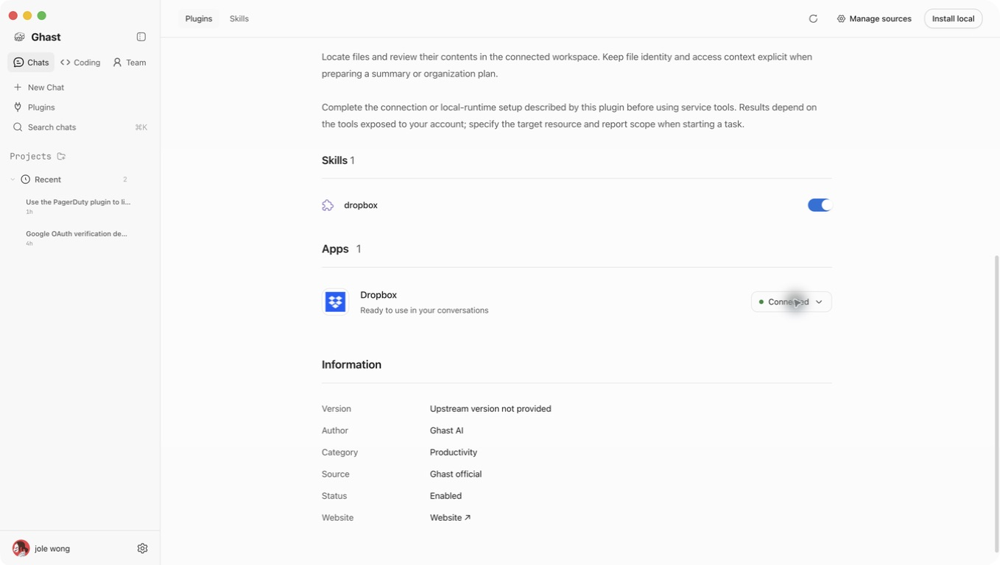
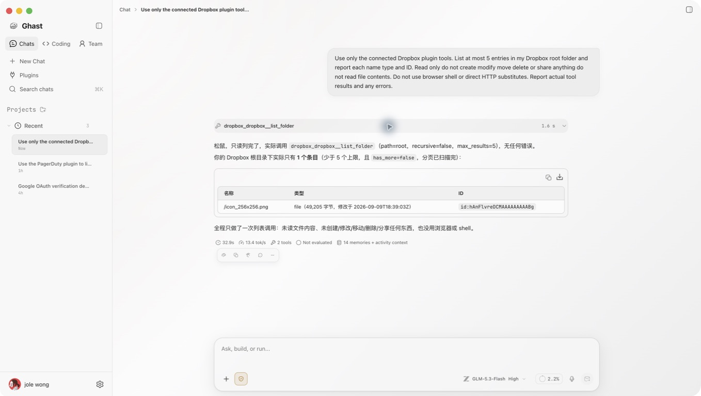

# Ghast AI Desktop Dropbox review evidence

This is evidence from the Ghast development client using the deployed first-party OAuth broker and the official Dropbox MCP server. It is not a claim that the currently downloadable desktop binary includes this integration or that Dropbox has granted Production status.

1. In Ghast, open Plugins, install Dropbox, and choose Connect account.
2. Complete the Dropbox consent screen for Ghast AI Desktop; the broker returns authorization to the desktop.
3. The plugin shows Connected. No user-supplied API key or application credential is required.
4. Ask the connected Dropbox plugin to list at most five root-folder entries without reading contents or modifying files.
5. The actual list_folder result returned the application icon file uploaded for branding, 49,205 bytes, with no further page. The tool's raw output was expanded and checked. No write tool was used.

The backend routes are deployed, but general client availability remains gated while production review is pending. The app supports up to 500 development users. Token-expiry refresh and cross-account testing have not been completed. A Ghast account is required; no personal account credentials are included in this public evidence. Contact jole.wong233@gmail.com for reviewer access arrangements.
