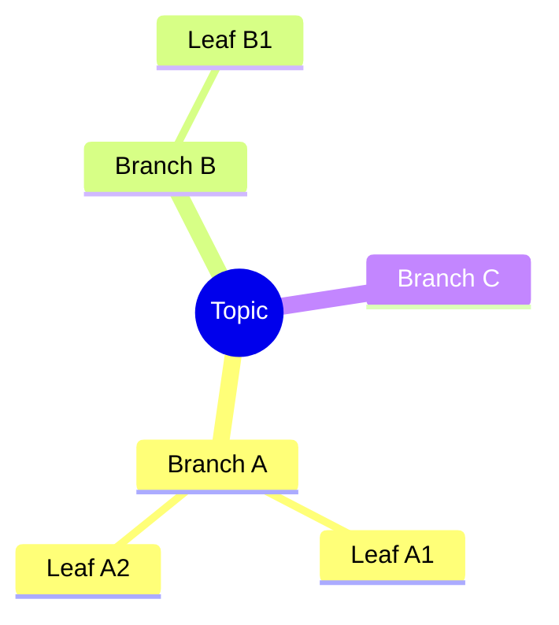

# Mermaid Mindmap

The user invoked `/mindmap` with arguments: $ARGUMENTS

## Instructions

Treat `$ARGUMENTS` as either a topic name (e.g. "machine learning") or a
structured outline. Produce a single Mermaid `mindmap` fenced code block that
captures 3-5 top-level branches under a central node, with 2-3 leaves per
branch where natural.

Output rules:

1. Reply with **only** the fenced code block — no preamble, no commentary
   after. The chat will render the mindmap inline.
2. The root node uses `((label))` (double parens) for the round shape.
3. Keep node labels short (2-5 words). Strip parentheses from labels;
   replace newlines inside a label with a space.
4. If the topic is too vague to outline confidently, ask for one
   clarifying question instead of producing a generic map.

Skeleton:
````markdown

````
